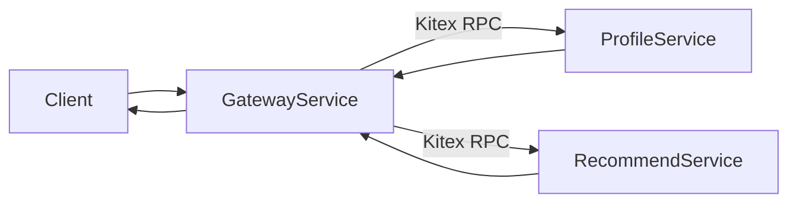

# Kitex 微服务聚合示例

这个示例新增了 3 个服务：

- `profile-service`：Kitex RPC，下游资料服务
- `recommend-service`：Kitex RPC，下游推荐服务
- `gateway-service`：Gin HTTP 网关，并发调用两个下游再聚合返回

## 架构



## 目录

- `idl/microdemo.thrift`
- `kitex_gen/microdemo/...`
- `cmd/profile-service/main.go`
- `cmd/recommend-service/main.go`
- `cmd/gateway-service/main.go`
- `internal/microdemo/config/config.go`
- `internal/microdemo/gateway/handler.go`
- `internal/microdemo/mockdata/mockdata.go`
- `internal/microdemo/profile/service.go`
- `internal/microdemo/recommend/service.go`

## 代码生成

第一次本地生成 Kitex 代码时可以用：

```bash
go install github.com/cloudwego/thriftgo@latest
go install github.com/cloudwego/kitex/tool/cmd/kitex@latest
kitex -module go-playground -service rpcdemo -tpl multiple_services idl/microdemo.thrift
```

说明：

- `idl/microdemo.thrift` 里定义了两个下游 RPC 服务
- `kitex_gen/` 下是生成代码，正常情况下不手改
- 网关不是 Kitex 服务，它是一个 HTTP 聚合层

## 启动方式

分别开三个终端：

```bash
go run ./cmd/profile-service
```

```bash
go run ./cmd/recommend-service
```

```bash
go run ./cmd/gateway-service
```

默认地址：

- `profile-service`：`127.0.0.1:9001`
- `recommend-service`：`127.0.0.1:9002`
- `gateway-service`：`127.0.0.1:8081`

健康检查：

```bash
curl http://127.0.0.1:8081/healthz
```

## 调用接口

网关接口：

```bash
curl "http://127.0.0.1:8081/feed/42"
```

支持的 query 参数：

- `limit`：推荐条数，默认 `3`
- `timeout_ms`：网关总超时，默认 `350`
- `scenario`：演示慢调用、失败、降级

## 场景演示

### 1. 正常聚合

```bash
curl "http://127.0.0.1:8081/feed/42"
```

效果：

- profile 和 recommend 都成功
- 网关返回完整聚合结果

### 2. 推荐服务失败，网关降级

```bash
curl "http://127.0.0.1:8081/feed/42?scenario=recommend_fail"
```

效果：

- profile 成功
- recommend RPC 失败
- 网关返回部分结果，并在 `errors` 中带上失败原因

### 3. 资料服务变慢，网关部分成功

```bash
curl "http://127.0.0.1:8081/feed/42?scenario=profile_slow"
```

效果：

- recommend 在超时前返回
- profile 超时
- 网关返回推荐结果，并标记 `degraded=true`、`timedOut=true`

### 4. 两个下游都变慢，总超时触发

```bash
curl -i "http://127.0.0.1:8081/feed/42?scenario=both_slow"
```

效果：

- 两个下游都没在总超时内完成
- 网关返回 `504 Gateway Timeout`

### 5. 一个下游慢，另一个下游失败

```bash
curl "http://127.0.0.1:8081/feed/42?scenario=profile_slow_recommend_fail"
```

效果：

- profile 超时
- recommend 失败且 gateway 内部做了一次重试
- 最终返回降级结果和错误列表

## 这个示例想展示什么

这个 demo 的重点不是“把 HTTP 换成 RPC”，而是展示 Go 在聚合型微服务中的表达方式：

- 一个请求里并发打多个下游 RPC
- 用一个 `context.WithTimeout(...)` 控制整条调用链
- 用 goroutine 扇出调用
- 用 channel 做结果汇总
- 某一路慢或失败时，快速返回部分结果而不是整条链路卡死

核心聚合逻辑在：

- `internal/microdemo/gateway/handler.go`

你可以重点看这几类代码：

- 创建总超时 `context`
- 启两个 goroutine 分别调用下游
- `select` 同时等 profile/recommend/timeout
- 根据结果拼装部分成功或超时响应
